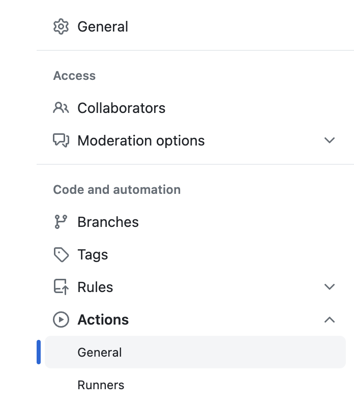
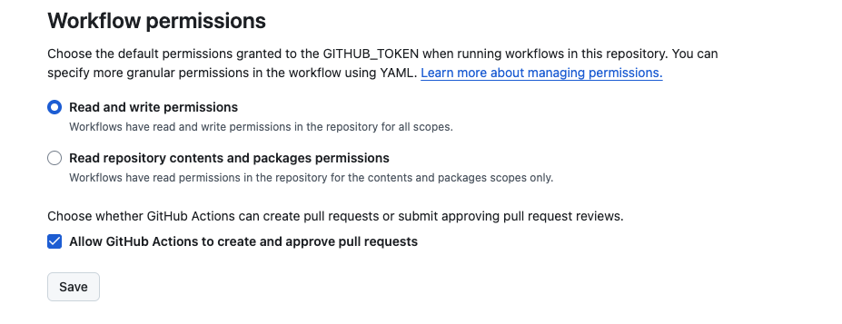

# Troubleshooting

### Unable to push changes into the branch

```
Unable to push changes into the branch=splunk_app_action_bbe00a4a32a796cc84b73b09abc09922
```

This error occurs when GitHub workflows don't have permission to create pull requests.

**Solution:**
1. Go to your Repository `Settings` > `Actions` > `General`
2. Scroll down to **Workflow permissions** section
3. Select **Read and write permissions**
4. Make sure **Allow GitHub Actions to create and approve pull requests** is checked





### App-Inspect Check Failures

#### Authentication Issues
```
Failed to authenticate with Splunkbase API
```

**Solution:** Verify your Splunkbase credentials:
- Ensure `splunkbase_username` and `splunkbase_password` are correctly set in GitHub secrets
- Test your credentials by logging into [Splunkbase](https://splunkbase.splunk.com) manually

#### Permission Issues with File Changes
```
App-inspect failed due to file permission issues
```

**Solution:** Enable automatic permission fixes:
```yaml
- uses: VatsalJagani/splunk-app-action@v4
  with:
    to_make_permission_changes: true
```

**⚠️ Warning:** Only use this if your app doesn't have custom executable files other than `.sh`, `.exe`, `.bat`, `.cmd`, `.msi`

### UCC Build Issues

#### Missing UCC Structure
```
globalConfig.json not found or package folder missing
```

**Solution:** 
1. Run `ucc-gen init` locally first to set up proper UCC structure
2. Ensure your app has both `globalConfig.json` and `package/` folder
3. Follow [UCC Framework documentation](https://splunk.github.io/addonfactory-ucc-generator/quickstart/)

### User Defined Commands Issues

#### Commands not executing
```
SPLUNK_APP_ACTION_1 command not found or failed
```

**Solution:**
- Ensure commands are valid Linux shell commands
- Remember: commands run in your app's root directory (not repo root)
- Use proper escaping for special characters: `\\;` instead of `;`

### Utility Issues

#### GitHub Token Problems
```
Failed to create pull request - authentication failed
```

**Solution:**
1. Create a personal access token in GitHub Settings > Developer settings > Personal access tokens
2. Add it to repository secrets as `MY_GITHUB_TOKEN`
3. Ensure the token has `repo` permissions

#### Logger Utility Issues
```
logger_log_files_prefix is required
```

**Solution:** Always provide required parameters for utilities:
```yaml
app_utilities: "logger"
logger_log_files_prefix: "my_app"
logger_sourcetype: "my_app:logs"  # recommended
```

### Python Dependency Management Issues

#### Requirements File Not Found
```
Requirements file not found at: lib/requirements.txt
```

**Solution:**
- Ensure the requirements file path is relative to `app_dir`
- Verify the file exists in your repository
- Check that the file name matches exactly (case-sensitive)

#### Dependency Installation Failures
```
Failed to install dependencies: pip install error
```

**Solution:**
- Check requirements.txt for syntax errors
- Ensure all package names are spelled correctly
- Verify that packages are available on PyPI
- Consider adding version constraints (e.g., `requests>=2.31.0`)

#### Conflicting Dependencies
```
ERROR: Cannot install package-a and package-b because these package versions have conflicting dependencies
```

**Solution:**
- Review your requirements.txt for version conflicts
- Use specific version pinning to resolve conflicts
- Consider using a requirements lock file

### Build Generation Issues

#### Missing app.conf
```
Missing 'version' attribute in app.conf [launcher] stanza
```

**Solution:**
- Ensure `default/app.conf` exists in your app
- Add required fields to app.conf:
  ```ini
  [launcher]
  version = 1.0.0
  
  [id]
  name = MyApp
  
  [package]
  id = my_app
  ```

#### Build Path Issues
```
Build directory not found or access denied
```

**Solution:**
- Ensure your workflow checks out the repository first: `uses: actions/checkout@v4`
- Verify the `app_dir` path is correct and relative to repository root
- Check that the directory contains a valid Splunk app structure

### AppInspect Timeout Issues

#### Check Times Out
```
App-inspect check timed out after 240 seconds
```

**Solution:**
- Large apps may take longer to validate
- Consider using local AppInspect instead:
  ```yaml
  local_app_inspect: true
  ```
- For production, the Splunkbase API is recommended despite longer wait times

### Multiple Feature Conflicts

#### Mutually Exclusive Features Error
```
Error: Multiple build features detected: UCC-Gen, Python-Dependency-Management
```

**Solution:**
- Only use ONE of these features at a time:
  - UCC-Gen (`use_ucc_gen: true`)
  - Python Dependency Management (`python_requirements_file`)
  - Splunk Python SDK utility (`app_utilities: splunk_python_sdk`)
- Remove or disable the conflicting features from your workflow

### SARIF Publishing Issues

#### Resource Not Accessible - Missing Permissions
```
Error: Resource not accessible by integration
Warning: Caught an exception while gathering information for telemetry: HttpError: Resource not accessible by integration
```

**Root Cause:** The GitHub token doesn't have the required `security-events: write` permission to upload SARIF files to GitHub Code Scanning.

**Solution:** Add explicit permissions to your workflow file:

```yaml
name: Build with AppInspect
on: [push, pull_request]

jobs:
  build:
    runs-on: ubuntu-latest
    permissions:
      contents: read          # Required to checkout code
      security-events: write  # Required for SARIF upload
    steps:
      - uses: actions/checkout@v4
      - uses: VatsalJagani/splunk-app-action@v4
        with:
          app_dir: "my_app"
          local_app_inspect: true
          # publish_sarif is enabled by default
```

**Alternative:** If you don't need SARIF reports, disable them:
```yaml
- uses: VatsalJagani/splunk-app-action@v4
  with:
    app_dir: "my_app"
    local_app_inspect: true
    publish_sarif: false  # Disable SARIF upload
```

**Understanding SARIF vs PR Comments:**
- SARIF reports create **Code Scanning alerts** in the Security tab, NOT pull request comments
- To view results: Go to repository → Security → Code scanning alerts
- Results appear in PR checks as "Code scanning results / Splunk AppInspect"
- For PR comments, check the "App-Inspect Check" in the Checks tab instead

#### Git Repository Not Detected
```
git call failed. Continuing with commit SHA from user input or environment. 
Error: The checkout path provided to the action does not appear to be a git repository.
```

**Root Cause:** This warning appears when SARIF upload runs after artifact download, which doesn't preserve git metadata.

**Impact:** This is a **warning, not an error**. SARIF upload will continue using the commit SHA from the environment. No action needed.

**To eliminate the warning:** Ensure the SARIF upload happens before any artifact downloads that change directories.

#### Code Scanning Not Enabled
```
Failed to upload SARIF: Code scanning is not enabled for this repository
```

**Solution:**
1. Go to repository `Settings` > `Security` > `Code security and analysis`
2. Enable "Code scanning"
3. Or ensure you have a CodeQL workflow configured

#### Invalid SARIF Format
```
SARIF upload failed: Invalid SARIF file format
```

**Solution:**
- This is usually an internal issue with SARIF generation
- Report the issue on the GitHub repository with your workflow logs
- As a workaround, disable SARIF publishing: `publish_sarif: false`

## Getting Help

If you encounter issues not covered here:

1. **Check the Examples** - Review the [examples page](examples.md) for working configurations
2. **Review Inputs** - Verify your inputs against the [inputs reference](inputs.md)
3. **Enable Debug Logging** - Add this to your workflow:
   ```yaml
   env:
     ACTIONS_STEP_DEBUG: true
   ```
4. **Search Issues** - Look for similar problems in [GitHub Issues](https://github.com/VatsalJagani/splunk-app-action/issues)
5. **Open an Issue** - If you've found a bug or need help, create a new issue with:
   - Your workflow YAML
   - Relevant error messages
   - Steps to reproduce
   - Expected vs actual behavior
